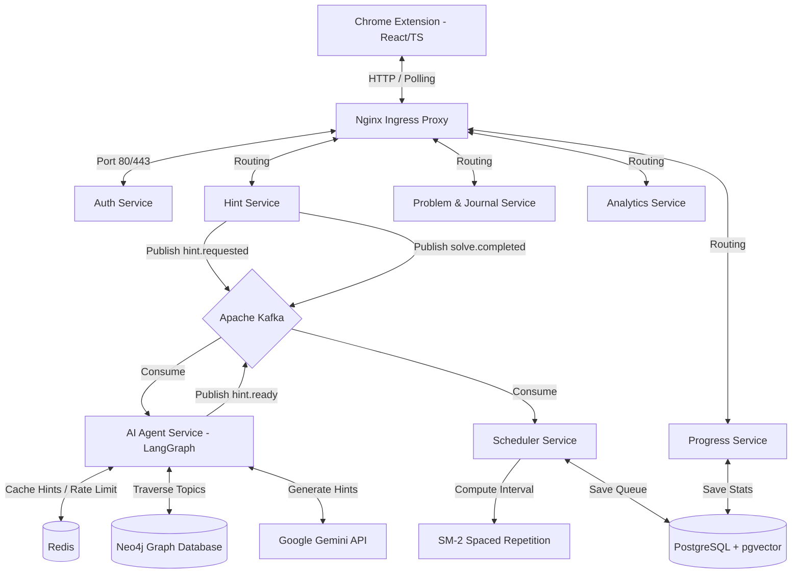

# DSA Buddy ⚡

DSA Buddy is an intelligent, event-driven learning companion designed to help developers master Data Structures and Algorithms (DSA). By combining a React/TypeScript Chrome Extension with a Python-based FastAPI microservices backend, DSA Buddy monitors your active problem-solving sessions on popular competitive programming websites and provides progressive, Socratic coding hints without giving away solutions.

It also tracks your progress and automates review intervals using a spaced repetition scheduling system to ensure long-term concepts retention.

---

## 🏗️ Architecture Overview

The system is built as an event-driven microservices architecture communicating asynchronously through **Apache Kafka** and unified behind an **Nginx Ingress Reverse Proxy**.



---

## 🚀 Key Features

1. **Socratic AI Tutor**: Integrates with Google's Gemini API and LangGraph to analyze your draft code in real-time, pointing out syntax/logic errors and nudging you toward the correct solution.
2. **Spaced Repetition Scheduler (SM-2)**: Dynamically calculates next review dates for solved problems using the SuperMemo-2 algorithm. It rates your retention quality by measuring your solve speed against difficulty baselines.
3. **Multi-Platform Scraper**: Content scripts automatically detect problem metadata, platforms, and draft source code on **LeetCode, Codeforces, AtCoder, and HackerRank**.
4. **Interactive Dashboard**: View progression levels, active heatmaps, streak stats, algorithm frequency patterns, and custom daily problem recommendations (1 Easy, 3 Medium, 1 Hard).
5. **Coding Journal**: Keep structured notebooks of optimal approaches and learning reflections linked to specific problems.

---

## 🛠️ Tech Stack

*   **Frontend**: React (Vite), TypeScript, Framer Motion, Chrome Extension APIs
*   **Backend**: Python (FastAPI), Uvicorn, Confluent Kafka
*   **Databases**: PostgreSQL (with `pgvector` enabled), Redis, Neo4j
*   **Orchestration**: Docker Compose, Nginx (Ingress Proxy)
*   **AI/ML**: LangGraph, LangChain, Google Gemini Pro

---

## ⚙️ How to Run locally

### Prerequisites
*   Docker & Docker Desktop installed
*   Node.js (v18+) & npm
*   A Gemini API Key (set in `.env`)

### 1. Configure Environment Variables
Copy `.env.example` to `.env` in the root folder:
```bash
cp .env.example .env
```
Fill in the credentials, including:
*   `JWT_SECRET`: A secure key for user sessions.
*   `GEMINI_API_KEY`: Your Google AI Studio API Key.

### 2. Start the Backend Microservices
Spin up all infrastructure components and services using Docker Compose:
```bash
docker compose up --build -d
```
This boots up Nginx, Kafka, Postgres, Neo4j, Redis, and all FastAPI services.

### 3. Seed the Databases
To enable problem searches and AI graph context, seed the databases:
```bash
# Seed LeetCode problems into PostgreSQL
docker compose exec scheduler-service python scripts/seed_problems.py

# Seed the DSA topic hierarchy and prerequisites into Neo4j
docker compose exec ai-agent-service python scripts/seed-neo4j.py
```

### 4. Install the Chrome Extension
1. Open Google Chrome and navigate to `chrome://extensions/`.
2. Enable **Developer mode** (top-right toggle).
3. Build the extension locally:
   ```bash
   cd chrome-extension
   npm install
   npm run build
   ```
4. Click **Load unpacked** on Chrome and select the `chrome-extension/dist` folder.

---

## 📂 Project Directory Structure

```
├── chrome-extension/       # React/TS Chrome Extension (Vite)
│   ├── src/
│   │   ├── content-script.ts # Code scraper & status observer
│   │   ├── pages/          # Dashboard, Hints, Search, Journal tabs
│   │   └── background/     # Extension background workers
├── services/               # FastAPI Microservices
│   ├── ai-agent-service/   # LangGraph + Gemini AI tutoring engine
│   ├── hint-service/       # Hint API queue controller
│   ├── scheduler-service/  # Spaced repetition calculation (SM-2)
│   ├── progress-service/   # XP, level, and LeetCode profile sync
│   ├── problem-service/    # Custom Trie search and daily problem generator
│   └── analytics-service/  # Heatmaps, pattern analytics, and leaderboards
├── infrastructure/         # Config templates (Nginx, Postgres, Redis)
└── docker-compose.yml      # Multi-container stack config
```

---

## 💡 Spaced Repetition Algorithm (SM-2)
Quality score ($q$) is dynamically mapped (0-5) from user solve times:
*   $\text{Ratio} \le 0.5 \implies q=5$ (Perfect/Fast)
*   $\text{Ratio} \le 1.0 \implies q=3$ (Correct/On-Time)
*   $\text{Ratio} > 1.5 \implies q=1$ (Struggled/Slow)

Intervals ($I$) and Ease Factor ($EF$) updates:
$$EF' = EF + (0.1 - (5 - q) \cdot (0.08 + (5 - q) \cdot 0.02))$$
$$I(n) = \begin{cases} 1 & \text{if } n=1 \\ 6 & \text{if } n=2 \\ \text{round}(I(n-1) \cdot EF) & \text{if } n > 2 \end{cases}$$
If a user fails a review ($q < 3$), the repetition counter resets to `0` and interval restarts at `1` day.
